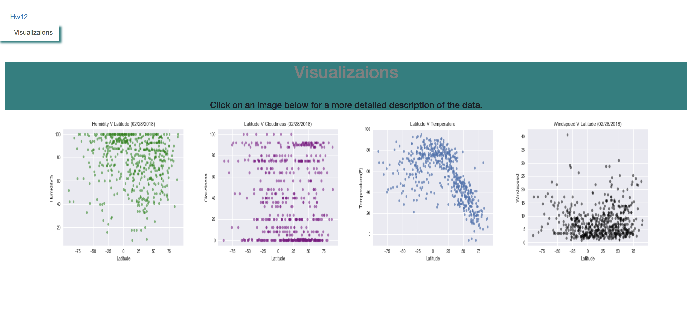

HW12 - Building visualization webpage with HTML and Cloudiness

In this project i built a webpage from scratch that uses charts i made from Weather data using an API.
The webpage can be viewed from the index.html file, I made the charts using python.
I visuzlized Temperature (F) vs. Latitude, Humidity (%) vs. Latitude, Cloudiness (%) vs. Latitude, and Wind Speed (mph) vs. Latitude.

